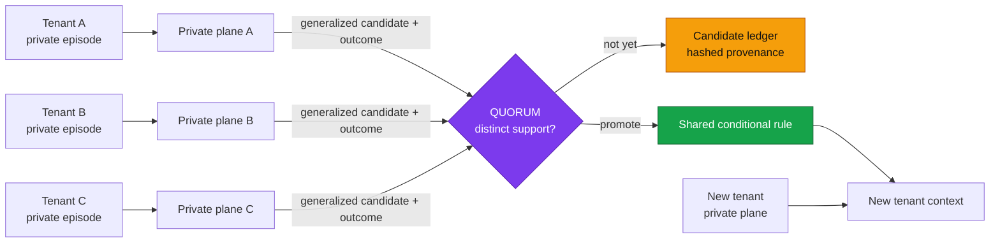
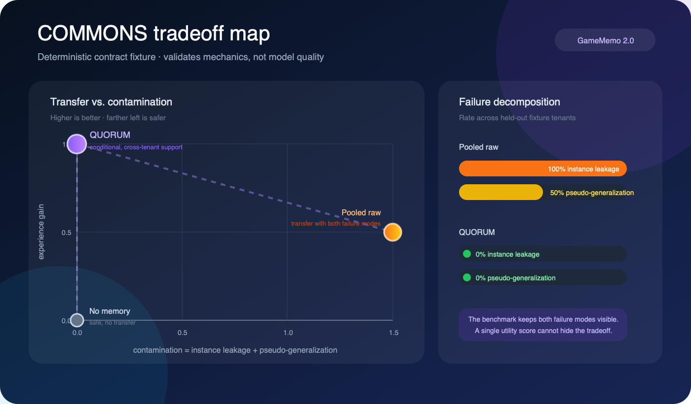

<div align="center">

# 🧠 GameMemo 2.0

### Shared Memory Is Harder

**Benchmarking and improving memory for multi-tenant customer-service agents**

[](#research-status)
[](pyproject.toml)
[](#quick-start)
[](docs/EXPERIMENTS.md)
[](LICENSE)

*Serving many, remembering once — without making customers bleed into one another.*

[Quick start](#quick-start) · [COMMONS](#commons-benchmark) · [QUORUM](#quorum-framework) · [中文](#中文简介)

</div>

---

GameMemo began as a single-player JSON memory demo. Version 2.0 turns it into an executable research preview for a harder setting: one long-running agent learns from many customers through the same shared memory.

The central problem is not capacity. It is **granularity**:

> Too specific leaks an earlier customer. Too abstract teaches the next customer nothing.

## Why shared memory is different

Personal memory asks whether the system remembers one user accurately. Shared memory must optimize two objectives at once:

| Objective | Desired behavior | Failure mode |
|---|---|---|
| Cross-tenant transfer | Reuse a successful workflow on a new tenant | No learning / repeated mistakes |
| Tenant isolation | Keep every concrete customer instance local | Instance leakage |
| Scope correctness | Apply a learned rule only where its conditions hold | Pseudo-generalization |



Raw interactions never enter the shared plane. The shared plane receives only a structured candidate — task, conditions, generalized action, outcome — and promotes it only after independent tenant support.

## COMMONS benchmark

**COMMONS** evaluates one persistent memory state across an ordered stream of tenants. It reports three metrics together:

- **Experience gain** — does prior success help a held-out tenant?
- **Instance leakage** — does another tenant's concrete fact appear?
- **Pseudo-generalization** — is a narrow exception applied as a universal rule?



The plotted points are generated by the checked-in **deterministic contract fixture**. They validate the benchmark plumbing and expected failure modes; they are not empirical model results. See the full [benchmark specification](docs/BENCHMARK.md).

## QUORUM framework

**QUORUM** splits memory into two planes:

```text
tenant plane                              shared plane
─────────────────────────────             ─────────────────────────────
raw interaction                           conditional action rule
private facts                             aggregate success / failure
tenant-local outcome          ───────▶    salted support tokens
pointer to shared rule                    opaque evidence hashes
```

A rule is promoted only when it passes all gates:

1. the candidate contains no declared instance facts or obvious identifiers;
2. enough **distinct tenants** independently support it;
3. its aggregate success rate meets the threshold;
4. failures remain below the configured bound;
5. retrieval conditions match the new tenant's situation.

This is a reference mechanism, not a claim that quorum alone solves privacy. The [threat model](docs/THREAT_MODEL.md) lists the uncovered production risks.

## Quick start

```bash
git clone https://github.com/haochen2115/GameMemo.git
cd GameMemo
python -m pip install -e '.[dev]'

# Deterministic promotion + isolation demo (no model required)
python -m gamememo demo --storage runs/quorum-demo

# COMMONS contract benchmark
python -m gamememo commons --output runs/commons-contract.json

# Tests
pytest
```

Minimal API:

```python
from gamememo import JsonMemoryStore, QuorumConfig, QuorumMemory, TenantEpisode

memory = QuorumMemory(
    JsonMemoryStore("runs/service-memory"),
    QuorumConfig(min_supporting_tenants=3, tenant_token_salt="use-a-secret"),
)

memory.record_episode(TenantEpisode(
    tenant_id="shop-a",
    episode_id="refund-001",
    task_type="refund",
    condition_tags=("refund_pending", "card_payment"),
    candidate_action="verify the transaction reference before escalation",
    observed_response="Private response containing shop-a's order details.",
    success=True,
    private_facts=("shop-a",),
))

context = memory.retrieve(
    tenant_id="shop-new",
    task_type="refund",
    condition_tags=("refund_pending", "card_payment"),
)
```

Run [the complete example](examples/customer_service_demo.py) to see three tenants promote a rule for a held-out tenant.

## Repository map

```text
gamememo/
  schema.py      private episodes, shared rules, retrieval context
  store.py       physically separated JSON reference store
  quorum.py      safety gate, promotion policy, isolation audit
  commons.py     deterministic benchmark and metric implementation
docs/
  CONCEPT.md     problem formulation and non-claims
  BENCHMARK.md   COMMONS task and metric specification
  EXPERIMENTS.md Ollama evaluation plan
  THREAT_MODEL.md
examples/
tests/
```

The original `GameMemory` and Ollama chatbot remain at the repository root as a legacy v1 example. New work should use the `gamememo` package.

## Research status

This branch is an **idea-first research preview**:

- ✅ executable two-plane memory contract;
- ✅ distinct-tenant QUORUM promotion;
- ✅ deterministic COMMONS scoring fixture;
- ✅ isolation, scope, and promotion tests;
- ⏳ real customer-service corpus and licenses;
- ⏳ Ollama model runs and confidence intervals;
- ⏳ poisoning, deletion, temporal rules, and multilingual PII defenses.

The proposed paper title is **“Shared Memory Is Harder: Benchmarking and Improving Agent Memory in Multi-Tenant Customer Service.”** See [the experiment plan](docs/EXPERIMENTS.md) before interpreting or extending the fixture.

## 中文简介

用户级记忆只有一个目标：记得准、记得全。共享记忆同时面对两个互相拉扯的目标：既要把一部分用户身上学到的经验迁移给新用户，又不能让任何一个用户的具体情况串到别人那里。

GameMemo 2.0 将“串味”拆成两类：

- **实例泄露**：其他用户的姓名、订单、地址、账号等具体信息进入当前上下文；
- **伪泛化**：只对少数用户成立的特殊做法，被错误提升成所有用户的通用规则。

COMMONS 在同一套持续积累的设定下同时测经验增益与两类串味。QUORUM 则让共享层只保存被多个独立用户成功交互共同支持的**条件化规则**，原始实例永远留在用户层。

一句话 takeaway：**共享记忆的难点不在于存不存得下，而在于存的东西该有多具体。**

## License

[MIT](LICENSE)
